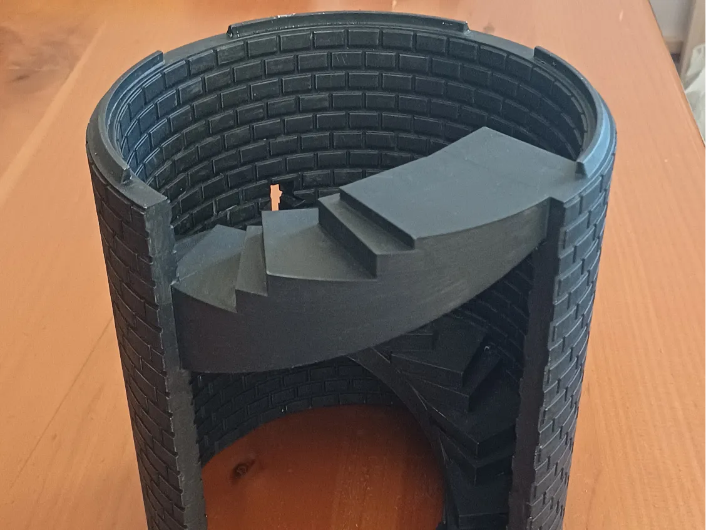

# all-ttrpg

This is the repository for all of my open-source TTRPG things

## Index

- 3d models (made in OpenSCAD - all licensed [Creative Commons Attribution-ShareAlike 4.0](3d-models/LICENSE-CC-BY-SA-4.0))
  - Parametric circle + square AoE measuring tool ([OpenSCAD src](3d-models/measuring/aoe-circle-square.scad),
    [MakerWorld](https://makerworld.com/en/models/2045220-parametric-ttrpg-aoe-circle-square-measuring-tool)).
  - Stackable spiral staircase tower ([OpenSCAD src](3d-models/tower/Tower.scad),
    [MakerWorld](https://makerworld.com/en/models/2943460-stackable-spiral-staircase-tower-for-ttrpgs-25mm)).
- [rgb-led-control](rgb-led-control/README.md): program to make an RGB heartbeat with an ESP32 + 2x RGB LEDs. Licensed
  [Apache 2.0](rgb-led-control/LICENSE-APACHE).

## Gallery

### [Circle + square AoE measuring tool](3d-models/measuring/README.md)

### [Spiral staircase tower](3d-models/tower/README.md)

### [rgb-led-control](rgb-led-control/README.md)

Minis from various sources - heart from
[SF3DPrints on MakerWorld](https://makerworld.com/en/models/229829-anatomically-accurate-heart)

<video src="https://github.com/user-attachments/assets/bc340950-369f-4721-ab5e-caf0e4af5077"/>
